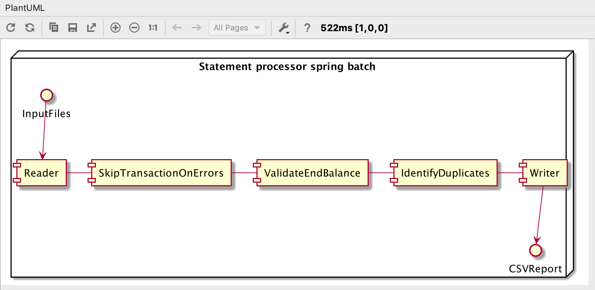

#  Transaction processing spring batch 

Spring batch for processing user transaction in daily basis and in the end output is generated in csv form.

## Input 
Two types of input format are possible. 
* CSV files
* xml files

## Output 
Report is created as csv file.
* One csv file with transaction Errors
    * Duplication transaction
    * Invalid end balance ( start balance + mutation != end balance)
* Second csv file with valid transaction.

## UserGuide : How to ?

### Running: 
 * **Example**: `java -jar statement-processor-0.0.1-SNAPSHOT.jar -Dspring.batch.job.names=readXMLFileJob `
    * readXMLFileJob --> xml based Input.
    * readCSVFileJob --> csv based input.
    * Default / no Parameter --> Will run both jobs in sequentially.

### Input CSV file path: 
To change csv file path. 
   * **Example**: `csv.transaction.detail.multiple.files=csv/records*.csv`
   * **Default**: `csv.transaction.detail.multiple.files=csv/records*.csv`
 
### Input XML file path:
To change xml file path.
  * **Example**: `xml.transaction.detail.multiple.files=xml/records*.xml`
  * **Default**: `xml.transaction.detail.multiple.files=xml/records*.xml`

### Output duplicate & invalid end balance report file:
To change report file path.
  * **Example**: `report.error.transaction.detail.file=reports/errorTransactionReport.csv`
  * **Default**: `report.error.transaction.detail.file=reports/errorTransactionReport.csv`

### Output valid transaction report file:
To change report file path.
  * **Example**: `report.valid.transaction.detail.file=reports/validTransactionReport.csv`
  * **Default**: `report.valid.transaction.detail.file=reports/validTransactionReport.csv`

## Sample
sample out are placed on the folder. `./sample/`
